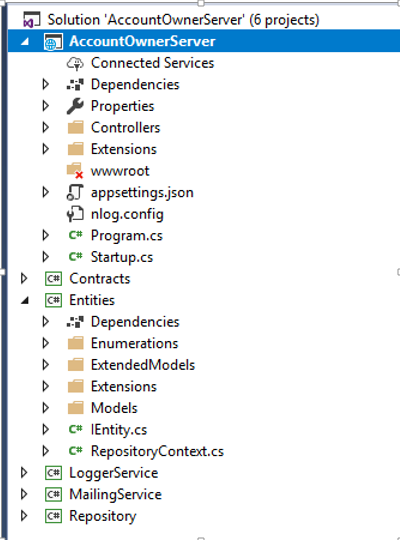
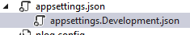
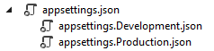

<div align="center">

<h1>ASP.NET Core Web API 最佳实践</h1>

> 英文版：[ASP.NET-Core-Web-API-Best-Practices-Guide](https://code-maze.us12.list-manage.com/track/click?u=9bb15645129501e5249a9a8e1&id=986d07e1f0&e=1184a539da)。如果你也有好的建议和实践，欢迎 PR

</div>

- [介绍](#介绍)
  - [Startup 类 和 服务配置](#startup-类-和-服务配置)
  - [项目组织](#项目组织)
  - [基于环境的设置](#基于环境的设置)
  - [数据访问层](#数据访问层)
  - [控制器](#控制器)
  - [处理全局异常](#处理全局异常)
  - [使用过滤器移除重复代码](#使用过滤器移除重复代码)
  - [Microsoft.AspNetCore.all 元包](#microsoftaspnetcoreall-元包)
  - [路由](#路由)
  - [日志](#日志)
  - [加密](#加密)
  - [内容协商](#内容协商)
  - [使用 JWT](#使用-jwt)
  - [使用 BasicAuthentication](#使用-basicauthentication)
  - [短地址算法](#短地址算法)
  - [后台服务](#后台服务)
  - [输入验证](#输入验证)
  - [缩略图](#缩略图)
  - [读取 `app.config`](#读取-appconfig)
  - [在集成测试中新增 API](#在集成测试中新增-api)
  - [SyndicationFeed](#syndicationfeed)
  - [MultipartFormDataContent](#multipartformdatacontent)
  - [NewtonsoftJson  ](#newtonsoftjson)
- [总结](#总结)

> 如果内容有调整，请使用 [Markdown All in One](https://marketplace.visualstudio.com/items?itemName=yzhang.markdown-all-in-one) 的 `create Table of Contents/update Table of Contents` 进行目录结构更新。

## 介绍

当我们编写一个项目的时候，我们的主要目标是使它能如期运行，并尽可能地满足所有用户需求。

但是，你难道不认为创建一个能正常工作的项目还不够吗？同时这个项目不应该也是可维护和可读的吗？

事实证明，我们需要把更多的关注点放到我们项目的可读性和可维护性上。这背后的主要原因是我们或许不是这个项目的唯一编写者。一旦我们完成后，其他人也极有可能会加入到这里面来。

因此，我们应该把关注点放到哪里呢？

在这一份指南中，关于开发 .NET Core Web API 项目，我们将叙述一些我们认为会是最佳实践的方式。进而让我们的项目变得更好和更加具有可维护性。

现在，让我们开始想一些可以应用到 ASP.NET Web API 项目中的一些最佳实践。

### Startup 类 和 服务配置

> STARTUP CLASS AND THE SERVICE CONFIGURATION

在 `Startup` 类中，有两个方法：`ConfigureServices` 是用于服务注册，`Configure` 方法是向应用程序的请求管道中添加中间件。

因此，最好的方式是保持 `ConfigureServices` 方法简洁，并且尽可能地具有可读性。当然，我们需要在该方法内部编写代码来注册服务，但是我们可以通过使用 `扩展方法` 来让我们的代码更加地可读和可维护。

例如，让我们看一个注册 CORS 服务的不好方式：

```csharp
public void ConfigureServices(IServiceCollection services)
{
    services.AddCors(options =>
    {
        options.AddPolicy("CorsPolicy", builder => builder.AllowAnyOrigin()
            .AllowAnyMethod()
            .AllowAnyHeader()
            .AllowCredentials());
    });
}
```

尽管这种方式看起来挺好，也能正常地将 CORS 服务注册成功。但是想象一下，在注册了十几个服务之后这个方法体的长度。

这样一点也不具有可读性。

一种好的方式是通过在扩展类中创建静态方法：

```csharp
public static class ServiceExtensions
{
    public static void ConfigureCors(this IServiceCollection services)
    {
        services.AddCors(options =>
        {
            options.AddPolicy("CorsPolicy", builder => builder.AllowAnyOrigin()
                .AllowAnyMethod()
                .AllowAnyHeader()
                .AllowCredentials());
        });
    }
}
```

然后，只需要调用这个扩展方法即可：

```csharp
public void ConfigureServices(IServiceCollection services)
{
    services.ConfigureCors();
}
```

了解更多关于 .NET Core 的项目配置，请查看：[.NET Core Project Configuration](https://code-maze.com/net-core-web-development-part2/)

### 项目组织

> PROJECT ORGANIZATION

我们应该尝试将我们的应用程序拆分为多个小项目。通过这种方式，我们可以获得最佳的项目组织方式，并能将关注点分离（SoC）。我们的实体、契约、访问数据库操作、记录信息或者发送邮件的业务逻辑应该始终放在单独的 .NET Core 类库项目中。

应用程序中的每个小项目都应该包含多个文件夹用来组织业务逻辑。

这里有个简单的示例用来展示一个复杂的项目应该如何组织：

<div align="center">



</div>

### 基于环境的设置

> ENVIRONMENT BASED SETTINGS

当我们开发应用程序时，它处于开发环境。但是一旦我们发布之后，它将处于生产环境。因此，将每个环境进行隔离配置往往是一种好的实践方式。

在 .NET Core 中，这一点很容易实现。

一旦我们创建好了项目，就已经有一个 `appsettings.json` 文件，当我们展开它时会看到 `appsettings.Development.json` 文件：

<div align="center">



</div>

此文件中的所有设置将用于开发环境。

我们应该添加另一个文件 `appsettings.Production.json`，将其用于生产环境：

<div align="center">



</div>

生产文件将位于开发文件下面。

设置修改后，我们就可以通过不同的 appsettings 文件来加载不同的配置，取决于我们应用程序当前所处环境，.NET Core 将会给我们提供正确的设置。更多关于这一主题，请查阅：[Multiple Environments in ASP.NET Core.](https://docs.microsoft.com/en-us/aspnet/core/fundamentals/environments?view=aspnetcore-3.0)

### 数据访问层

> DATA ACCESS LAYER

在一些不同的示例教程中，我们可能看到 DAL 的实现在主项目中，并且每个控制器中都有实例。我们不建议这么做。

当我们编写 DAL 时，我们应该将其作为一个独立的服务来创建。在 .NET Core 项目中，这一点很重要，因为当我们将 DAL 作为一个独立的服务时，我们就可以将其直接注入到 IOC（控制反转）容器中。IOC 是 .NET Core 内置功能。通过这种方式，我们可以在任何控制器中通过构造函数注入的方式来使用。

```csharp
public class OwnerController: Controller
{
    private readonly IRepository _repository;
    public OwnerController(IRepository repository)
    {
        _repository = repository;
    }
}
```

### 控制器

> CONTROLLERS

控制器应该始终尽量保持整洁。我们不应该将任何业务逻辑放置于内。

因此，我们的控制器应该通过构造函数注入的方式接收服务实例，并组织 HTTP 的操作方法（GET，POST，PUT，DELETE，PATCH...）:

```csharp
public class OwnerController : Controller
{
    private readonly ILoggerManager _logger;
    private readonly IRepository _repository;
    public OwnerController(ILoggerManager logger, IRepository repository)
    {
        _logger = logger;
        _repository = repository;
    }

    [HttpGet]
    public IActionResult GetAllOwners()
    {
    }
    [HttpGet("{id}", Name = "OwnerById")]
    public IActionResult GetOwnerById(Guid id)
    {
    }
    [HttpGet("{id}/account")]
    public IActionResult GetOwnerWithDetails(Guid id)
    {
    }
    [HttpPost]
    public IActionResult CreateOwner([FromBody]Owner owner)
    {
    }
    [HttpPut("{id}")]
    public IActionResult UpdateOwner(Guid id, [FromBody]Owner owner)
    {
    }
    [HttpDelete("{id}")]
    public IActionResult DeleteOwner(Guid id)
    {
    }
}
```

我们的 Action 应该尽量保持简洁，它们的职责应该包括处理 HTTP 请求，验证模型，捕捉异常和返回响应。

```csharp
[HttpPost]
public IActionResult CreateOwner([FromBody]Owner owner)
{
    try
    {
        if (owner.IsObjectNull())
        {
            return BadRequest("Owner object is null");
        }
        if (!ModelState.IsValid)
        {
            return BadRequest("Invalid model object");
        }
        _repository.Owner.CreateOwner(owner);
        return CreatedAtRoute("OwnerById", new { id = owner.Id }, owner);
    }
    catch (Exception ex)
    {
        _logger.LogError($"Something went wrong inside the CreateOwner action: { ex} ");
        return StatusCode(500, "Internal server error");
    }
}
```

在大多数情况下，我们的 action 应该将 `IActonResult` 作为返回类型（有时我们希望返回一个特定类型或者是 `JsonResult` ...）。通过使用这种方式，我们可以很好地使用 .NET Core 中内置方法的返回值和状态码。

使用最多的方法是：

- OK => returns the 200 status code
- NotFound => returns the 404 status code
- BadRequest => returns the 400 status code
- NoContent => returns the 204 status code
- Created, CreatedAtRoute, CreatedAtAction => returns the 201 status code
- Unauthorized => returns the 401 status code
- Forbid => returns the 403 status code
- StatusCode => returns the status code we provide as input

### 处理全局异常

> HANDLING ERRORS GLOBALLY

在上面的示例中，我们的 action 内部有一个 `try-catch` 代码块。这一点很重要，我们需要在我们的 action 方法体中处理所有的异常（包括未处理的）。一些开发者在 action 中使用 `try-catch` 代码块，这种方式明显没有任何问题。但我们希望 action 尽量保持简洁。因此，从我们的 action 中删除 `try-catch` ,并将其放在一个集中的地方会是一种更好的方式。.NET Core 给我们提供了一种处理全局异常的方式，只需要稍加修改，就可以使用内置且完善的的中间件。我们需要做的修改就是在 `Startup` 类中修改 `Configure` 方法：

```csharp
public void Configure(IApplicationBuilder app, IWebHostEnvironment env)
{
    app.UseExceptionHandler(config =>
    {
        config.Run(async context =>
        {
            context.Response.StatusCode = StatusCodes.Status500InternalServerError;
            context.Response.ContentType = "application/json";

            var error = context.Features.Get<IExceptionHandlerFeature>();
            var ex = error?.Error;
            await context.Response.WriteAsync(new ErrorModel
            {
                StatusCode = StatusCodes.Status500InternalServerError,
                ErrorMessage = ex?.Message
            }.ToString());
        });
    });

    app.UseRouting();

    app.UseEndpoints(endpoints =>
    {
        endpoints.MapControllers();
    });
}
```

我们也可以通过创建自定义的中间件来实现我们的自定义异常处理：

```csharp
// You may need to install the Microsoft.AspNetCore.Http.Abstractions package into your project
public class CustomExceptionMiddleware
{
    private readonly RequestDelegate _next;
    private readonly ILogger<CustomExceptionMiddleware> _logger;
    public CustomExceptionMiddleware(RequestDelegate next, ILogger<CustomExceptionMiddleware> logger)
    {
        _next = next;
        _logger = logger;
    }

    public async Task Invoke(HttpContext httpContext)
    {
        try
        {
            await _next(httpContext);
        }
        catch (Exception ex)
        {
            _logger.LogError("Unhandled exception....", ex);
            await HandleExceptionAsync(httpContext, ex);
        }
    }

    private Task HandleExceptionAsync(HttpContext httpContext, Exception ex)
    {
        //todo
        return Task.CompletedTask;
    }
}

// Extension method used to add the middleware to the HTTP request pipeline.
public static class CustomExceptionMiddlewareExtensions
{
    public static IApplicationBuilder UseCustomExceptionMiddleware(this IApplicationBuilder builder)
    {
        return builder.UseMiddleware<CustomExceptionMiddleware>();
    }
}
```

之后，我们只需要将其注入到应用程序的请求管道中即可：

```csharp
public void Configure(IApplicationBuilder app, IWebHostEnvironment env)
{
    app.UseCustomExceptionMiddleware();
}
```

### 使用过滤器移除重复代码

> USING ACTIONFILTERS TO REMOVE DUPLICATED CODE

ASP.NET Core 的过滤器可以让我们在请求管道的特定状态之前或之后运行一些代码。因此如果我们的 action 中有重复验证的话，可以使用它来简化验证操作。

当我们在 action 方法中处理 PUT 或者 POST 请求时，我们需要验证我们的模型对象是否符合我们的预期。作为结果，这将导致我们的验证代码重复，我们希望避免出现这种情况，（基本上，我们应该尽我们所能避免出现任何代码重复。）我们可以在代码中通过使用 ActionFilter 来代替我们的验证代码：

```csharp
if (!ModelState.IsValid)
{
    //bad request and logging logic
}
```

我们可以创建一个过滤器：

```csharp
public class ModelValidationAttribute : ActionFilterAttribute
{
    public override void OnActionExecuting(ActionExecutingContext context)
    {
        if (!context.ModelState.IsValid)
        {
            context.Result = new BadRequestObjectResult(context.ModelState);
        }
    }
}
```

然后在 `Startup` 类的 `ConfigureServices` 函数中将其注入：

```csharp
services.AddScoped<ModelValidationAttribute>();
```

现在，我们可以将上述注入的过滤器应用到我们的 action 中。

### Microsoft.AspNetCore.all 元包

> MICROSOFT.ASPNETCORE.ALL META-PACKAGE

注：如果你使用的是 2.1 和更高版本的 ASP.NET Core。建议使用 Microsoft.AspNetCore.App 包，而不是 Microsoft.AspNetCore.All。这一切都是出于安全原因。此外，如果使用 2.1 版本创建新的 WebAPI 项目，我们将自动获取 AspNetCore.App 包，而不是 AspNetCore.All。

这个元包包含了所有 AspNetCore 的相关包，EntityFrameworkCore 包，SignalR 包（version 2.1） 和依赖框架运行的支持包。采用这种方式创建一个新项目很方便，因为我们不需要手动安装一些我们可能使用到的包。

当然，为了能使用 Microsoft.AspNetCore.all 元包，需要确保你的机器安装了 .NET Core Runtime。

### 路由

> ROUTING

在 .NET Core Web API 项目中，我们应该使用属性路由代替传统路由，这是因为属性路由可以帮助我们匹配路由参数名称与 Action 内的实际参数方法。另一个原因是路由参数的描述，对我们而言，一个名为 "ownerId" 的参数要比 "id" 更加具有可读性。

我们可以使用 **[Route]** 属性来在控制器的顶部进行标注：

```csharp
[Route("api/[controller]")]
public class OwnerController : Controller
{
    [Route("{id}")]
    [HttpGet]
    public IActionResult GetOwnerById(Guid id)
    {
    }
}
```

还有另一种方式为控制器和操作创建路由规则：

```csharp
[Route("api/owner")]
public class OwnerController : Controller
{
    [Route("{id}")]
    [HttpGet]
    public IActionResult GetOwnerById(Guid id)
    {
    }
}
```

对于这两种方式哪种会好一些存在分歧，但是我们经常建议采用第二种方式。这是我们一直在项目中采用的方式。

当我们谈论路由时，我们需要提到路由的命名规则。我们可以为我们的操作使用描述性名称，但对于 路由/节点，我们应该使用 NOUNS 而不是 VERBS。

一个较差的示例：

```csharp
[Route("api/owner")]
public class OwnerController : Controller
{
    [HttpGet("getAllOwners")]
    public IActionResult GetAllOwners()
    {
    }
    [HttpGet("getOwnerById/{id}"]
    public IActionResult GetOwnerById(Guid id)
    {
    }
}
```

一个较好的示例：

```csharp
[Route("api/owner")]
public class OwnerController : Controller
{
    [HttpGet]
    public IActionResult GetAllOwners()
    {
    }
    [HttpGet("{id}"]
    public IActionResult GetOwnerById(Guid id)
    {
    }
}

```

更多关于 Restful 实践的细节解释，请查阅：[Top REST API Best Practices](https://code-maze.com/top-rest-api-best-practices/)

### 日志

> LOGGING

如果我们打算将我们的应用程序发布到生产环境，我们应该在合适的位置添加一个日志记录机制。在生产环境中记录日志对于我们梳理应用程序的运行很有帮助。

.NET Core 通过继承 `ILogger` 接口实现了它自己的日志记录。通过借助依赖注入机制，它可以很容易地使用。

```csharp
public class TestController: Controller
{
    private readonly ILogger _logger;
    public TestController(ILogger<TestController> logger)
    {
        _logger = logger;
    }
}
```

然后，在我们的 action 中，我们可以通过使用 \_logger 对象借助不同的日志级别来记录日志。

.NET Core 支持使用于各种日志记录的 Provider。因此，我们可能会在项目中使用不同的 Provider 来实现我们的日志逻辑。

NLog 是一个很不错的可以用于我们自定义的日志逻辑类库，它极具扩展性。支持结构化日志，且易于配置。我们可以将信息记录到控制台，文件甚至是数据库中。

想了解更多关于该类库在 .NET Core 中的应用，请查阅：[.NET Core series – Logging With NLog.](https://code-maze.com/net-core-web-development-part3/)

Serilog 也是一个很不错的类库，它适用于 .NET Core 内置的日志系统。

### 加密

> CRYPTOHELPER

我们不会建议将密码以明文形式存储到数据库中。出于安全原因，我们需要对其进行哈希处理。这超出了本指南的内容范围。互联网上有大量哈希算法，其中不乏一些不错的方法来将密码进行哈希处理。

但是如果需要为 .NET Core 的应用程序提供易于使用的加密类库，CryptoHelper 是一个不错的选择。

CryptoHelper 是适用于 .NET Core 的独立密码哈希库，它是基于 PBKDF2 来实现的。通过创建 `Data Protection` 栈来将密码进行哈希化。这个类库在 NuGet 上是可用的，并且使用也很简单：

```csharp
using CryptoHelper;

// Hash a password
public string HashPassword(string password)
{
    return Crypto.HashPassword(password);
}

// Verify the password hash against the given password
public bool VerifyPassword(string hash, string password)
{
    return Crypto.VerifyHashedPassword(hash, password);
}
```

### 内容协商

> CONTENT NEGOTIATION

默认情况下，.NET Core Web API 会返回 JSON 格式的结果。大多数情况下，这是我们所希望的。

但是如果客户希望我们的 Web API 返回其它的响应格式，例如 XML 格式呢？

为了解决这个问题，我们需要进行服务端配置，用于按需格式化我们的响应结果：

```csharp
public void ConfigureServices(IServiceCollection services)
{
    services.AddControllers().AddXmlDataContractSerializerFormatters();
}
```

但有时客户端会请求一个我们 Web API 不支持的格式，因此最好的实践方式是对于未经处理的请求格式统一返回 406 状态码。这种方式也同样能在 ConfigureServices 方法中进行简单配置：

```csharp
public void ConfigureServices(IServiceCollection services)
{
    services.AddControllers(options => options.ReturnHttpNotAcceptable = true).AddXmlDataContractSerializerFormatters();
}
```

我们也可以创建我们自己的格式化规则。

这一部分内容是一个很大的主题，如果你希望了解更对，请查阅：[Content Negotiation in .NET Core](https://code-maze.com/content-negotiation-dotnet-core/)

### 使用 JWT

现如今的 Web 开发中，JSON Web Tokens (JWT) 变得越来越流行。得益于 .NET Core 内置了对 JWT 的支持，因此实现起来非常容易。JWT 是一个开发标准，它允许我们以 JSON 格式在服务端和客户端进行安全的数据传输。

我们可以在 ConfigureServices 中配置 JWT 认证：

```csharp
public void ConfigureServices(IServiceCollection services)
{
    services.AddAuthentication(JwtBearerDefaults.AuthenticationScheme)
        .AddJwtBearer(options =>
        {
            options.TokenValidationParameters = new TokenValidationParameters
            {
                ValidateIssuer = true,
                ValidIssuer = _authToken.Issuer,

                ValidateAudience = true,
                ValidAudience = _authToken.Audience,

                ValidateIssuerSigningKey = true,
                IssuerSigningKey = new SymmetricSecurityKey(Encoding.UTF8.GetBytes(_authToken.Key)),

                RequireExpirationTime = true,
                ValidateLifetime = true,

                options.Events = new JwtBearerEvents
                {
                    OnAuthenticationFailed = context =>
                    {
                        context.Response.StatusCode = StatusCodes.Status401Unauthorized;
                        context.Response.ContentType = "application/json; charset=utf-8";
                        var message = env.IsDevelopment() ? context.Exception.ToString() : "An error occurred processing your authentication.";
                        var result = JsonConvert.SerializeObject(new { message });
                        return context.Response.WriteAsync(result);
                    }
                };
                //others
            };
        });
}
```

为了能在应用程序中使用它，我们还需要在 Configure 中调用下面一段代码：

```csharp
public void Configure(IApplicationBuilder app, IWebHostEnvironment env)
{
    app.UseAuthentication();
}
```

此外，创建 Token 可以使用如下方式：

```csharp
var securityToken = new JwtSecurityToken(
                claims: new Claim[]
                {
                    new Claim(ClaimTypes.NameIdentifier,user.Id),
                    new Claim(ClaimTypes.Email,user.Email)
                },
                issuer: _authToken.Issuer,
                audience: _authToken.Audience,
                notBefore: DateTime.Now,
                expires: DateTime.Now.AddDays(_authToken.Expires),
                signingCredentials: new SigningCredentials(
                    new SymmetricSecurityKey(Encoding.UTF8.GetBytes(_authToken.Key)),
                    SecurityAlgorithms.HmacSha256Signature));

Token = new JwtSecurityTokenHandler().WriteToken(securityToken)
```

基于 Token 的用户验证可以在控制器中使用如下方式：

```csharp
var auth = await HttpContext.AuthenticateAsync();
var id = auth.Principal.Claims.FirstOrDefault(x => x.Type.Equals(ClaimTypes.NameIdentifier))?.Value;
```

我们也可以将 JWT 用于授权部分，只需添加角色声明到 JWT 配置中即可。

更多关于 .NET Core 中 JWT 认证和授权部分，请查阅：[authentication-aspnetcore-jwt-1](https://code-maze.com/authentication-aspnetcore-jwt-1/) 和 [authentication-aspnetcore-jwt-2](https://code-maze.com/authentication-aspnetcore-jwt-2/)

### 使用 BasicAuthentication

首先，在需要进行 authentication 的 controller 上使用 `AuthorizeAttribute` 进行标注（也可以使用自定的 AuthorizeAttribute）。

然后，定义并实现 `BasicAuthenticationHandler` 类，如下所示：

```csharp
public class BasicAuthenticationHandler : AuthenticationHandler<AuthenticationSchemeOptions>
{
    public BasicAuthenticationHandler(
        IOptionsMonitor<AuthenticationSchemeOptions> options,
        ILoggerFactory logger,
        UrlEncoder encoder,
        ISystemClock clock) : base(options, logger, encoder, clock)
    {
    }

    protected override async Task<AuthenticateResult> HandleAuthenticateAsync()
    {
        await Task.Yield();

        // skip authentication if endpoint has [AuthorizeAttribute] attribute
        var endpoint = Context.GetEndpoint();
        if (endpoint?.Metadata?.GetMetadata<AuthorizeAttribute>() == null)
            return AuthenticateResult.NoResult();

        if (!Request.Headers.ContainsKey("Authorization"))
            return AuthenticateResult.Fail("Missing Authorization Header");

        IUser user;
        try
        {
            user = ExtractUserNameAndPassword();
        }
        catch (Exception e)
        {
            Logger.LogError(e, "Invalid Authorization Header");
            return AuthenticateResult.Fail("Invalid Authorization Header");
        }

        if (user == null)
            return AuthenticateResult.Fail("Invalid Username or Password");

        var principal = new ClaimsPrincipal(new GenericPrincipal(new GenericIdentity(user.Identity), user.Roles));
        var ticket = new AuthenticationTicket(principal, Scheme.Name);

        return AuthenticateResult.Success(ticket);
    }

    private IUser ExtractUserNameAndPassword()
    {
        var authHeader = AuthenticationHeaderValue.Parse(Request.Headers["Authorization"]);
        var credentialBytes = Convert.FromBase64String(authHeader.Parameter!);
        var credentials = Encoding.UTF8.GetString(credentialBytes).Split(new[] { ':' }, 2);
        var username = credentials[0];
        var password = credentials[1];

        var repository = new ServiceUserRepository();
        return repository.Authenticate(username, password, out _);
    }
}
```

最后，在 `Program` 类中进行注册，如下所示：

```csharp
 builder.Services
     .AddAuthentication("BasicAuthentication")
     .AddScheme<AuthenticationSchemeOptions, BasicAuthenticationHandler>("BasicAuthentication", null);

// 在 Swagger 中集成 Basic Authentication
builder.Services.AddSwaggerGen(config =>
{
    config.CustomSchemaIds(x => x.FullName);
    var basicSecurityScheme = new OpenApiSecurityScheme
    {
        Type = SecuritySchemeType.Http,
        Scheme = "basic",
        Reference = new OpenApiReference { Id = "BasicAuth", Type = ReferenceType.SecurityScheme }
    };
    config.AddSecurityDefinition(basicSecurityScheme.Reference.Id, basicSecurityScheme);
    config.AddSecurityRequirement(new OpenApiSecurityRequirement
    {
        { basicSecurityScheme, Array.Empty<string>() }
    });
});

......

app.UseAuthentication();
app.UseAuthorization();

......
```

### 短地址算法

> Creating a Url Shortener Service

如果你想通过 .NET Core 来构建短地址服务，那么这里有一个比较不错的生成算法推荐给你：

```csharp
public static string GenerateShortUrl()
{
    string urlsafe = string.Empty;
    Enumerable.Range(48, 75)
        .Where(i => i < 58 || i > 64 && i < 91 || i > 96)
        .OrderBy(o => new Random().Next())
        .ToList()
        .ForEach(i => urlsafe += Convert.ToChar(i));
    string token = urlsafe.Substring(new Random().Next(0, urlsafe.Length), new Random().Next(2, 6));

    return token;
}
```

如果你想了解更多关于如何创建短地址服务，这里有一份教程推荐给你：[Creating a Url Shortener Service From Scratch with .Net Core 3.0](https://blog.usejournal.com/creating-a-url-shortener-service-from-scratch-with-net-core-e8ebacad12c1)

### 后台服务

> BACKGROUNDSERVICE

得益于 Asp.Net Core 框架的优越性，我们可以不需要安装任何外部依赖库就可以轻易实现一个功能强大且能长期运行的后台服务。

首先，创建一个继承自抽象类的 `BackgroundService` 实现类，然后实现里面的抽象方法 `ExecuteAsync` 即可，你可以参考下述方式：

```csharp
public class NotificationService : BackgroundService
{
    private readonly NotificationSettings _settings;
    private readonly ILogger<NotificationService> _logger;
    public NotificationService(IOptions<NotificationSettings> settings, ILogger<NotificationService> logger)
    {
        _settings = settings.Value;
        _logger = logger;
    }

    protected override async Task ExecuteAsync(CancellationToken stoppingToken)
    {
        _logger.LogDebug($"GracePeriodManagerService is starting.");

        stoppingToken.Register(() => _logger.LogDebug($" GracePeriod background task is stopping."));

        while (!stoppingToken.IsCancellationRequested)
        {
            _logger.LogDebug("{0},GracePeriod task doing background work.", new[] { DateTime.Now });

            // do what you want

            await Task.Delay(_settings.CheckUpdateTime, stoppingToken);
        }
    }
}
```

> 这里需要注意一点的是，如果我们在构造函数注入的对象具有一定的作用域，这个时候直接注入该对象会发生 `InvalidOperationException` 的异常，此时建议通过注入 `IServiceScopeFactory` 对象来创建作用域从而间接获取目标对象。

接着，在 `Startup` 类中的 `ConfigureServices` 进行相关配置，示例如下：

```csharp
public void ConfigureServices(IServiceCollection services)
{
    services.Configure<NotificationSettings>(Configuration.GetSection(nameof(NotificationSettings)));
    services.AddHostedService<NotificationService>();
}
```

此时，我们就成功创建了一个可以长时间运行的后台服务。为了避免服务能及时在主进程退出时做相应处理，我们可以在 `Program` 类中进行如下配置：

```csharp
public static IHostBuilder CreateHostBuilder(string[] args) =>
    Host.CreateDefaultBuilder(args)
        .ConfigureWebHostDefaults(webBuilder =>
        {
            webBuilder.UseShutdownTimeout(TimeSpan.FromSeconds(5));
            webBuilder.UseStartup<Startup>();
        });
```

更多关于后台服务的部分，请查阅：[Background tasks with hosted services in ASP.NET Core](https://docs.microsoft.com/en-us/aspnet/core/fundamentals/host/hosted-services?view=aspnetcore-3.1&tabs=visual-studio)

### 输入验证

资源的输入验证可以采用多种方式，目前主要要如下方式：

- 属性级别：
  - Data Annotations
- 属性和对象级别：
  - IValidatableObject
  - ValidationAttribute

```csharp
public abstract class ModelResource : IValidatableObject
{
    [Display(Name = "名")]
    [Required(ErrorMessage = "{0} 是必填项")]
    [MaxLength(50, ErrorMessage = "{0} 的长度不能超过{1}")]
    public string FirstName { get; set; }
    [Display(Name = "姓")]
    [Required(ErrorMessage = "{0} 是必填项")]
    [MaxLength(50, ErrorMessage = "{0} 的长度不能超过{1}")]
    public string LastName { get; set; }

    public IEnumerable<ValidationResult> Validate(ValidationContext validationContext)
    {
        if (FirstName == LastName)
        {
            //yield return new ValidationResult("姓和名不能一样", new[] { nameof(EmployeeAddOrUpdateDto) });
            yield return new ValidationResult("姓和名不能一样", new[] { nameof(FirstName), nameof(LastName) });
        }
    }
}

public class CustomValidationAttribute:ValidationAttribute
{
    protected override ValidationResult IsValid(object value, ValidationContext validationContext)
    {
        var model = (ModelResource)validationContext.ObjectInstance;

        if (model.LastName == model.FirstName)
        {
            return new ValidationResult(ErrorMessage, new[] { nameof(ModelResource) });
        }
        return ValidationResult.Success;
    }
}
```

更多关于输入验证部分，请查阅：[Model validation in ASP.NET Core MVC and Razor Pages](https://docs.microsoft.com/en-us/aspnet/core/mvc/models/validation?view=aspnetcore-3.1)

### 缩略图

如果你想创建指定图片的缩略图，可以尝试用于 [System.Drawing.Common](https://github.com/dotnet/corefx) 来解决，示例代码如下所示：

```csharp
Image image = Image.FromFile(sourceFile);
Image thumb = image.GetThumbnailImage(300, 250, () => false, IntPtr.Zero);
thumb.Save(thumbFile);
```

> 如果在 Linux 上运行，需要提前安装 _libgdiplus_ 库：`apt install libgdiplus`

如果想创建视频文件的缩略图，可以尝试使用 [Xabe.FFmpeg](https://xabe.net/product/xabe_ffmpeg/) 来解决，示例代码如下所示：

```csharp
await Conversion.Snapshot(sourceFile, thumbFile, TimeSpan.FromSeconds(0)).Start();
```

> 如果在 Linux 上运行，需要提前安装 _ffmpeg_ 库：`apt install ffmpeg`

### 读取 `app.config`

在 .NET 应用程序中，`app.config` 是一个特殊文件，它会在程序编译后自动转换为主程序同名的 `xxx.dll.config` 文件。我们可以通过使用 `System.Configuration.ConfigurationManager` 来读取其中内容。为了能正常读取，我们需要确保将该文件的 `build action` 设置为 `Content`, `copy to output directory` 设置为 `Copy if newer/Copy always`。在非主程序类型的项目中如果想读取该文件，我们需要在对应的 `xxx.csproj` 中添加如下配置：

```
  <Target Name="CopyCustomContent" AfterTargets="AfterBuild">
    <Copy SourceFiles="app.config" DestinationFiles="$(OutDir)\ReSharperTestRunner.dll.config" />
    <Copy SourceFiles="app.config" DestinationFiles="$(OutDir)\testhost.dll.config" />
  </Target>
```

更多内容可参考：[ConfigurationManager doesn't find config file with "dotnet test"](https://github.com/dotnet/runtime/issues/22720)

### 在集成测试中新增 API

如果我们现在集成测试中新增接口用于测试应用程序的一些全局性配置是否正确，可以考虑使用 `ApplicationParts` 方式来解决这个问题。如下述示例代码：

```csharp

public class PayloadTestController : ApiController
{
    [HttpPost("test")]
    public IActionResult Process([FromBody] Person person)
    {
        return Ok(person);
    }
}

client = new ApiTestFactory<Program>()
    .WithWebHostBuilder(builder =>
    {
        builder.ConfigureServices(services =>
        {
            var partManager = (ApplicationPartManager)services
                .Last(descriptor => descriptor.ServiceType == typeof(ApplicationPartManager))
                .ImplementationInstance
            partManager.ApplicationParts.Add(new AssemblyPart(Assembly.GetAssembly(type(PayloadTestController))));
        });
    }).CreateClient();
```

### SyndicationFeed

```csharp
# write

private static string Format(SyndicationFeed value)
{
    var settings = new XmlWriterSettings
    {
        Encoding = Encoding.UTF8,
        NewLineHandling = NewLineHandling.Entitize,
        NewLineOnAttributes = true,
    };
    using var stream = new MemoryStream();
    using var xmlWriter = XmlWriter.Create(stream, settings);
    var rssFormatter = new Atom10FeedFormatter(value);
    rssFormatter.WriteTo(xmlWriter);
    xmlWriter.Flush();
    return Encoding.UTF8.GetString(stream.ToArray());
}

return Content(Format(feed), "application/atom+xml", Encoding.UTF8);

# read
private static SyndicationFeed ReadAsSyndicationFeed(ContentResult result)
{
    var respBody = result.Content;
    if (respBody == null)
        return null;
    var bytes = Encoding.UTF8.GetBytes(respBody);
    using var stream = new MemoryStream(bytes);
    using var xmlReader = XmlReader.Create(stream);
    var formatter = new Atom10FeedFormatter();
    formatter.ReadFrom(xmlReader);
    return formatter.Feed;
}
```

### MultipartFormDataContent

在 .NET Core 中，如果想对 MultipartFormDataContent 类型的数据进行处理，可以参考如下方式

```csharp
# write

using var memoryStream = new MemoryStream();
using (var archive = new ZipArchive(memoryStream, ZipArchiveMode.Create, true))
{
    var demoFile = archive.CreateEntry("foo.txt");

    await using (var entryStream = demoFile.Open())
    await using (var streamWriter = new StreamWriter(entryStream))
    {
        await streamWriter.WriteAsync("Bar!");
    }
}

using var multipartContent = new MultipartFormDataContent();
multipartContent.Add(new StreamContent(memoryStream), "zipArchive", "test.zip");
multipartContent.Add(new StringContent("hello world", Encoding.UTF8, MediaTypeNames.Text.Plain), "content");

var request = new HttpRequestMessage(HttpMethod.Post, requestUri);
request.Content = multipartContent;
var response = await httpClient.SendAsync(request);

# read
var dic = new Dictionary<string, object>();
var form = HttpContext.Request.Form;
var file = form.Files.FirstOrDefault(x => string.Equals(x.Name, "zipArchive"));
if (file != null)
{
    dic.Add("zipArchive", new ZipArchive(file.OpenReadStream()));
}

var firstName = form.FirstOrDefault(x => string.Equals(x.Key, "content", StringComparison.CurrentCultureIgnoreCase));
if (firstName.Key != null)
{
    dic.Add("content", firstName.Value);
}

```

### NewtonsoftJson  

由于 `.NET WebAPI` 和 `.NET Core API` 在处理请求时的 ModelBinder 逻辑有些差异（当类型不匹配时，.NET WebAPI 会兼容处理，但是在 .NET Core 中就会显示类型不匹配的问题）。当我们的接口是从 FX 迁移到 .NET Core 时，就需要考虑这种场景，可以添加如下配置，确保迁移过来的接口参数处理逻辑保持不变：

```csharp
services.AddControllers(options =>
{
    options.OutputFormatters.RemoveType<StringOutputFormatter>();
    options.OutputFormatters.RemoveType<HttpNoContentOutputFormatter>();
}).AddNewtonsoftJson(options =>
{
    #region this can be removed after upgrading to .NET 7
    const string enableSkipHandledError = "Microsoft.AspNetCore.Mvc.NewtonsoftJson.EnableSkipHandledError";
    AppContext.SetSwitch(enableSkipHandledError, true);
    #endregion

    options.SerializerSettings.Error += (sender, args) =>
    {
        var errorCtx = args.ErrorContext.Error;
        LogManager.GetLogger(nameof(Program)).Log(LogLevel.Error, errorCtx, $"can not process request body with incorrect type:{errorCtx.Message}");
        args.ErrorContext.Handled = true;
    };
    options.AddSerializerSettings();
});

```

更多信息可以参考这个 [issue](https://github.com/dotnet/aspnetcore/issues/37323)

## 总结

在这份指南中，我们的主要目的是让你熟悉关于使用 .NET Core 开发 web API 项目时的一些最佳实践。这里面的部分内容在其它框架中也同样适用。因此，熟练掌握它们很有用。

非常感谢你能阅读这份指南，希望它能对你有所帮助。
